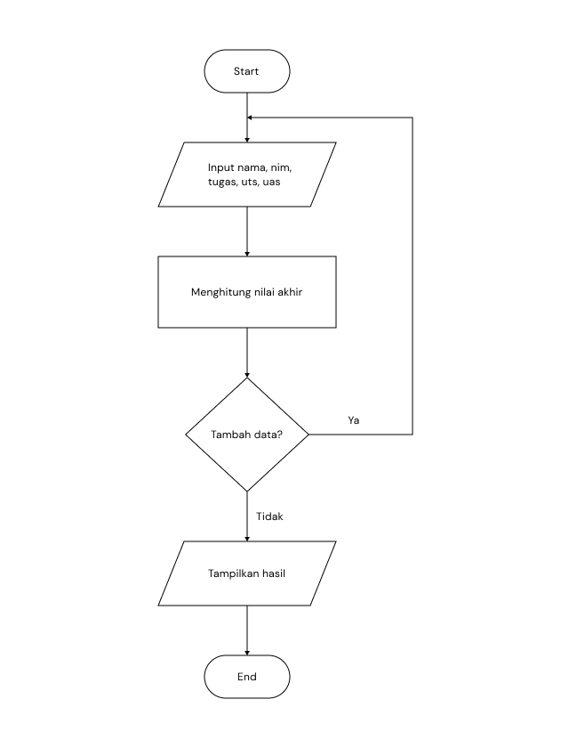
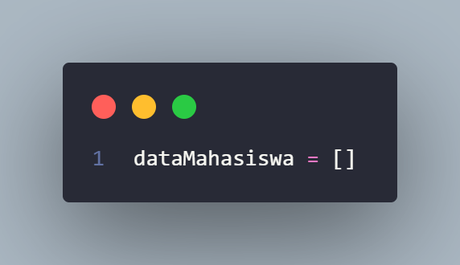
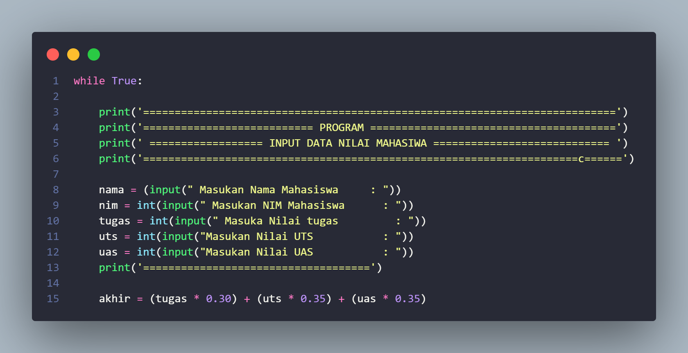
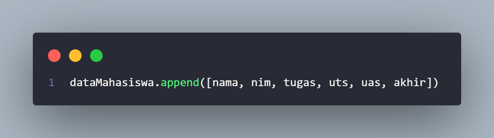
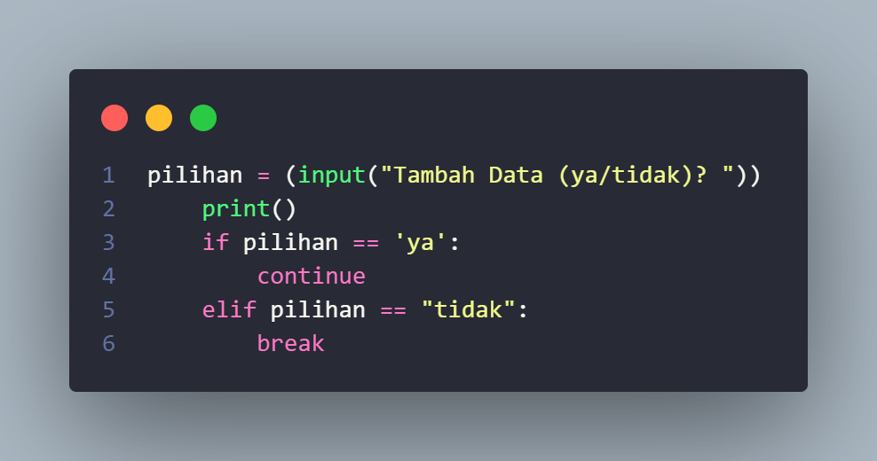
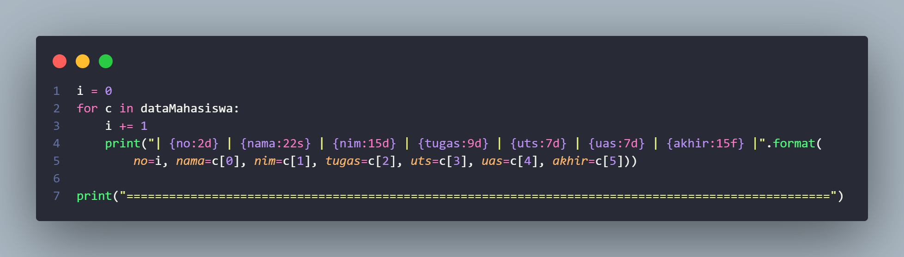
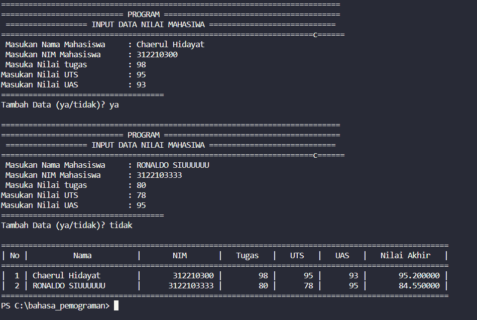
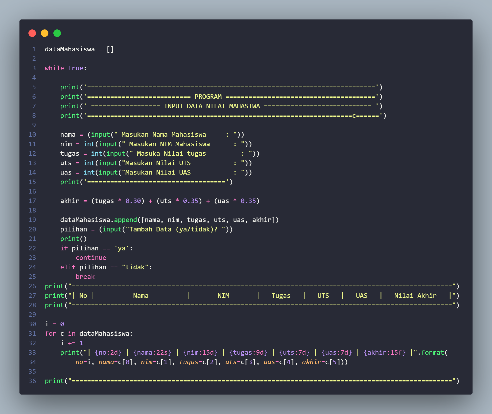

# pratikum4

# FlowChart

## **Inilah Flowchart Pratikum 4**

# Algoritma nya

1. buatlah list kosong untuk menampung data 
    

2. Gunakan statement `while` untuk melakukan perulangan

Buat variabel untuk menginput data
Hitung total sebagai nilai akhir
   

3. unakan `append()` untuk menambah data ke dalam list
    

4. Buat pilihan apakah ingin menambah data atau tidak, jika user menjawab "tidak"  maka program akan berhenti
   Jika User menjawab ya program  atau perulangan akan terus berlanjut
        

5.Tampilkan hasil dengan metode perulangan `for` yang tadi kita buat
    

## **# Dan Inilah Hasil Ouput nya** 
    

# **# Inilah hasil Full Codingan nya**
    

**Sekian Dari Saya tentang Penjelasan Algoritma Dan Flowchart Program Di atas
Saya Ucapkan Terima Kasih**